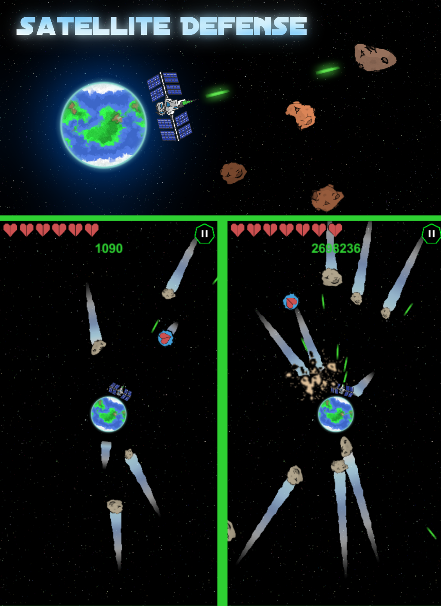

# Satellite Defense

**Satellite Defense** is a defense game about protecting planets and satellites from escalating enemy waves.

## Highlights
- Aim and fire defensive weapons at incoming enemies.
- Upgrade systems and pursue a higher score.
- Touch and joystick input support.
- Local save support.

## Development
- **Engine:** Unity 6000.0.59f2
- **Status:** Waiting

## Run locally
1. Clone the repository.
2. Open it in Unity Hub with the listed Unity version.
3. Open a scene in `Assets/Scenes` and press Play.
