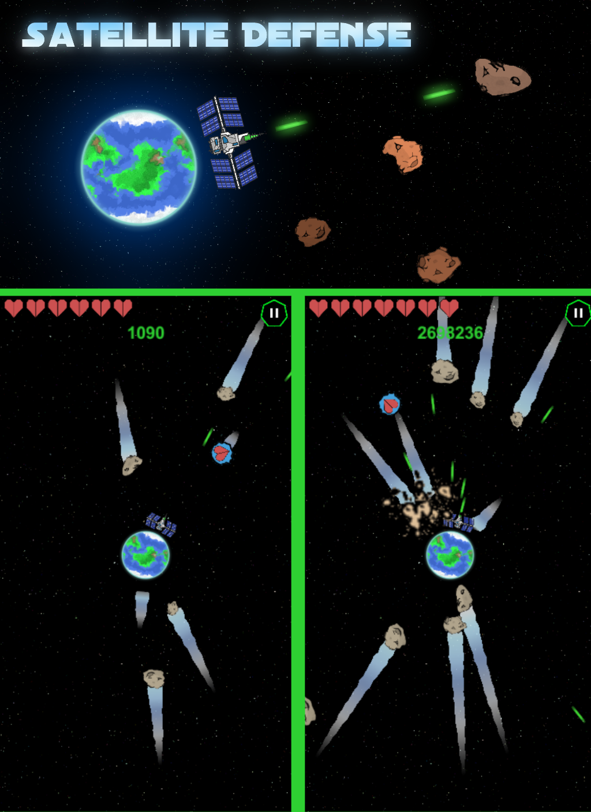

# Satellite Defense

  

<strong>A mobile arcade defense game about protecting a planet from asteroid impacts.</strong>

  
  
  
  

## About

**Satellite Defense** is a high-score game in a space-science-fiction setting. Control an orbital satellite, destroy incoming asteroids and keep the planet safe for as long as possible.

## Highlights

- **Planetary defense:** Track and destroy asteroid threats before they hit the planet.
- **Power-ups:** Defeated asteroids can drop weapon upgrades and health recovery.
- **High-score loop:** Survive longer, score higher and face increasingly chaotic attacks.
- **Customization:** Shop systems support different satellite, planet, asteroid and background designs.
- **Mobile-ready input:** Touch and joystick controls with local save support.

## Technical details

- **Engine:** Unity `6000.3.25f1`
- **Target platform:** Android
- **Status:** On hold

## Run locally

1. Clone the repository.
2. Open it in Unity Hub with Unity `6000.3.25f1`.
3. Open `Assets/Scenes/MainScene.unity` and press Play.

## Code structure

- `GameController` owns the game state and the four equipment catalogs. Pause and shop freeze simulation through `Time.timeScale`; UI animations use unscaled time.
- `IngameEntity` prefabs contain item definitions. `Savegame` owns purchased items, levels, selection, coins and best score. Gameplay never writes progress into prefabs.
- `LoadoutStats` combines the equipped item definitions and saved levels into a read-only set of gameplay values whenever the equipment changes. Attribute defaults, rounding and shared limits live there; weapon-specific shot and enemy spawn interval limits remain with their controllers. `GameController` coordinates the equipment and world objects.
- `IngameEntity` defines purchase prices and upgrade eligibility against an explicit progress view. The shop and save transactions use these same rules; a transaction evaluates its candidate save rather than the live global state.
- `SaveGameController` coordinates local progress through `SaveSession`. Gameplay reads a read-only view; purchases and selections commit to disk before the live state changes. Google Play/cloud-save and achievement placeholders have been removed.
- Weapons own their projectiles. Enemies and power-ups unregister when removed; round transitions clear transient objects. Audio sources are reused with a fixed limit.
- Equipped score multipliers multiply together. Other attributes add together. Fire/spawn rates represent seconds between events; rotation uses degrees per second and probability values use fractions from 0 to 1. Each item may contain an attribute type only once.

The attribute refactor preserves existing item values, prices, combination rules, rewards and abilities. Serialized attribute IDs and names used by JSON backups and icons remain stable. Renamed interval fields use `FormerlySerializedAs` to preserve existing prefab and scene settings. Runtime verification of this refactor is pending; no tests or builds were run for it.

The attribute editor remains available under **Tools > Attribute > IngameEntity Attribute Editor**. JSON imports are validated before any prefab is modified.

## Android release workflow

Unity Android Release Tools are integrated under `scripts/`, with the Unity build helper in `Assets/Editor/UnityAndroidBuild.cs`. The workflow supports signed APK/AAB builds, Google Play uploads and local Drive exports. Project-specific setup, the imported source revision and commands are documented in [scripts/README.md](scripts/README.md).

Local signing secrets and the existing shared Play account are configured. App-specific read and test-release permissions are saved, and API access has been confirmed. The Android target is API 36; unused Unity Analytics, crash reporting and purchasing services are disabled. The current project has no billing or advertising SDK. Store declarations and a new release still need completion; see the current status in [scripts/README.md](scripts/README.md). Tests, builds, exports and uploads require an explicit request under [AGENTS.md](AGENTS.md).

## Local saves

Progress is stored in `Application.persistentDataPath/Saves/savegame.json`, with the previous committed snapshot in `savegame.backup.json`. The versioned JSON envelope includes a SHA-256 checksum to detect file damage; this is not encryption or cheat protection. There is no PlayerPrefs migration.

`FileSaveStore` writes and flushes a temporary file, verifies its contents, then replaces the primary while retaining a valid backup. A corrupt or missing primary recovers from the backup. Temporary files are never loaded as committed progress. Unsupported versions or two unreadable saves block new progression and preserve the files instead of silently starting over. The UI explains recovery and storage errors.

Coin pickups update memory immediately and are saved in batches every five seconds on a background worker. Purchases, upgrades, loadout selection, round completion, pause, background/focus loss, menu return and normal shutdown flush pending changes. Failed purchases leave coins and equipment unchanged; failed reward writes retain pending progress for retry. An abrupt process kill can lose pickups since the last completed save, normally within the five-second autosave interval; disk errors or a suspended writer can extend that window.

## Validation

Run **Tools > Validation > Run regression checks** from edit mode. The checks cover checksums, malformed/future saves, backup recovery, interrupted writes, real filesystem failures, purchase rollback, background-save ordering, reward overflow, prefab scripts, all 36 shop items, repeated rounds, pause/background callbacks, joystick ownership, actual projectile collisions and one-time revival. They use real files in isolated temporary directories under `Logs`, leave player saves untouched and restore the previous play-mode start scene. Results are written to `Logs/Validation-results.txt`.

For unattended checks, run Unity with `-batchmode -nographics -projectPath <project> -executeMethod ProjectValidation.RunBatch -logFile <log>`. Omit `-quit`: the runner exits after the play-mode checks. Use a separate project copy if the project is already open in Unity.

The runner also prepares an isolated restart fixture. After that Unity process exits, launch another with `-batchmode -nographics -quit -projectPath <project> -executeMethod SaveStorageValidation.VerifyRestartCheck -logFile <log>`. It verifies saved coins, score, equipment and upgrades in the new process, ignores an unfinished temporary write, removes the fixture and writes `Logs/Save-restart-result.txt`.

An Android development APK can be built with `-batchmode -nographics -quit -buildTarget Android -projectPath <project> -executeMethod ProjectValidation.BuildAndroidDevelopment -logFile <log>`. It is debug-signed and written to `Builds/SatelliteDefense-development.apk`; this is a local test build, not a store release.

Before a release, test touch aiming and pickups on a phone, background/resume, audio and UI layout at the supported aspect ratios. Review gameplay balance as well: corrected damage, score multipliers, coin bonuses and item drops affect progression compared with the old implementation.
